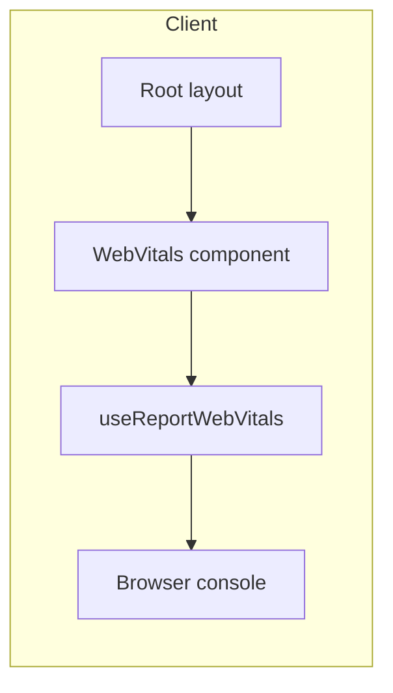

# Measure Core Web Vitals (console only)

## Approach

Use Next.js’s built-in `**useReportWebVitals**` from `next/web-vitals` (no new dependencies). Add a small client component that subscribes to metrics and logs them, then mount it once in the root layout so all pages are covered.

## Data flow

## Implementation

### 1. Create a Web Vitals client component

- **File:** [src/components/WebVitals.tsx](src/components/WebVitals.tsx) (new file).
- **Content:**
  - Mark as client: `"use client"`.
  - Import `useReportWebVitals` from `next/web-vitals`.
  - Define a **stable** callback (e.g. `reportWebVitals`) that:
    - Receives the metric object (`name`, `value`, `rating`, `id`, etc.).
    - Logs it to the console (e.g. `console.log(metric)` or a short message with `metric.name`, `metric.value`, `metric.rating`).
  - Call `useReportWebVitals(reportWebVitals)` inside the component.
  - Return `null` (no UI).
- **Why a separate component:** Keeps the client boundary small; the rest of the layout can stay server-rendered.

### 2. Mount the component in the root layout

- **File:** [src/app/layout.tsx](src/app/layout.tsx).
- **Change:** Import the new `WebVitals` component and render it inside `<body>`, e.g. next to or before `{children}` (exact position does not affect metrics).

## Metrics you’ll see

- **TTFB** – Time to First Byte
- **FCP** – First Contentful Paint
- **LCP** – Largest Contentful Paint
- **FID** – First Input Delay
- **CLS** – Cumulative Layout Shift
- **INP** – Interaction to Next Paint

Each log will include the metric `name`, `value`, `rating` (`"good"` / `"needs-improvement"` / `"poor"`), and `id` for the page load.

## Verification

- Run `pnpm dev`, open the app, and open DevTools → Console.
- Reload and interact with the page; you should see log entries for the metrics above as they are computed.

## Optional later steps (out of scope for this plan)

- Add an API route (e.g. `POST /api/web-vitals`) and send metrics with `navigator.sendBeacon` or `fetch` for persistence or analytics.
- Integrate with Google Analytics or Vercel Analytics using the same callback and their respective APIs.
